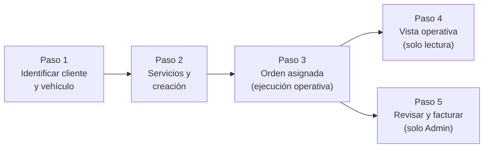

# Manual de uso — Kenzo Studio (Centro de control)

**Audiencia:** personal del taller — recepción, operadores, detallistas y gerencia.  
**Alcance:** operación diaria del panel: acceso, **roles y qué datos ve cada uno**, **módulo por módulo** (panel, órdenes, clientes, inventario, calendario, notificaciones, catálogo, lealtad, usuarios, auditoría) y **proceso por proceso** (ciclo completo de una orden desde la matrícula hasta facturación). Para instalación, Supabase y arranque del servidor, consulta [guia-ejecucion-usuario.md](./guia-ejecucion-usuario.md).

---

## Índice

1. [Acceso y sesión](#1-acceso-y-sesión)
2. [Roles, menú y visibilidad de datos](#2-roles-menú-y-visibilidad-de-datos)
3. [Panel principal (Dashboard)](#3-panel-principal-dashboard)
4. [Módulo: Órdenes de trabajo](#4-módulo-órdenes-de-trabajo)
5. [Ciclo de vida completo de una orden](#5-ciclo-de-vida-completo-de-una-orden)
6. [Módulo: Clientes](#6-módulo-clientes)
7. [Módulo: Inventario](#7-módulo-inventario)
8. [Módulo: Calendario](#8-módulo-calendario)
9. [Módulo: Notificaciones](#9-módulo-notificaciones)
10. [Módulo: Catálogo de servicios](#10-módulo-catálogo-de-servicios)
11. [Módulo: Lealtad y recompensas](#11-módulo-lealtad-y-recompensas)
12. [Módulo: Usuarios (Staff y accesos)](#12-módulo-usuarios-staff-y-accesos)
13. [Módulo: Auditoría](#13-módulo-auditoría)
14. [Diferencias entre roles en el día a día](#14-diferencias-entre-roles-en-el-día-a-día)
15. [Problemas frecuentes (usuario)](#15-problemas-frecuentes-usuario)
16. [Documentación relacionada](#16-documentación-relacionada)

---

## 1. Acceso y sesión

### Cómo entrar al sistema

1. Abre el navegador y escribe la dirección del sistema:
   - Si estás en el mismo PC donde corre el servidor: `http://localhost:3000`
   - Si accedes desde una tablet u otro equipo en la red del taller: `http://[IP del servidor]:3000`  
     (Ejemplo: `http://192.168.1.10:3000`)
2. Aparece la pantalla de **inicio de sesión** (`/login`).
3. Ingresa el **correo** y **contraseña** que el administrador creó para tu cuenta.
4. Haz clic en **Iniciar sesión**.

> **Importante — usa siempre la misma dirección.** Si un día entras con `localhost` y otro con la IP de red, el sistema no reconoce tu sesión (las cookies de autenticación son distintas por origen). Elige una sola URL para todo el equipo.

### Cómo cerrar sesión

En el encabezado superior derecho aparece el nombre del usuario y un menú de acciones. Selecciona **Cerrar sesión** para terminar la sesión de forma segura.

---

## 2. Roles, menú y visibilidad de datos

El sistema tiene cuatro roles. El administrador asigna el rol de cada usuario al crearlo.

| Rol | Nombre en pantalla | Acceso típico |
|-----|--------------------|---------------|
| `admin` | Administrador | Acceso completo a todos los módulos, facturación, usuarios, recompensas y auditoría. Ve **todas** las órdenes y citas del taller. Es el único que puede **elegir a quién se asigna** una orden nueva (en el paso de servicios). |
| `manager` | Gerente / Manager | Mission Control, catálogo de servicios, búsqueda global y alta de órdenes. **No** gestiona usuarios, recompensas ni auditoría. Sus listas (órdenes, calendario, búsqueda de órdenes) muestran solo lo **asignado a él**; al crear una orden, queda **autoasignada** a sí mismo (no puede elegir otro técnico). |
| `operator` | Operador | Panel de trabajo, órdenes, clientes, calendario y notificaciones. Puede **crear órdenes** (flujo matrícula → servicios) y registrar cliente+vehículo si hace falta. Sin catálogo en menú, sin módulo de inventario en menú, sin usuarios/recompensas/auditoría. Solo ve datos de **sus** asignaciones. |
| `detailer` | Detallista | Igual que operador en permisos y visibilidad: ejecución y órdenes propias. |

### Menú lateral — qué ve cada rol

| Sección del menú | Admin | Gerente | Operador | Detallista |
|-----------------|:-----:|:-------:|:--------:|:----------:|
| Panel | ✓ | ✓ | ✓ | ✓ |
| Órdenes | ✓ | ✓ | ✓ | ✓ |
| Clientes | ✓ | ✓ | ✓ | ✓ |
| Inventario | ✓ | — | — | — |
| Calendario | ✓ | ✓ | ✓ | ✓ |
| Notificaciones | ✓ | ✓ | ✓ | ✓ |
| Catálogo | ✓ | ✓ | — | — |
| Recompensas | ✓ | — | — | — |
| Usuarios | ✓ | — | — | — |
| Auditoría | ✓ | — | — | — |

> **Inventario en el menú:** solo el **administrador** tiene el enlace al módulo de inventario. Aun así, **operador** y **detallista** pueden **elegir productos** al crear una orden (el sistema consulta el catálogo de existencias por API en ese paso), sin entrar a la pantalla de gestión de inventario.

### Búsqueda global (Mission Control)

La caja de búsqueda del encabezado Mission Control está disponible para **administrador** y **gerente**. Los resultados de **órdenes** respetan la misma regla de asignación: el admin ve coincidencias en todo el taller; gerente, operador y detallista solo en órdenes **asignadas a su usuario**.

### Visibilidad de órdenes, citas y listados

En todo el panel aplica la misma idea:

| Área | Administrador | Gerente, operador y detallista |
|------|---------------|--------------------------------|
| Lista **Órdenes** (`/dashboard/orders`) | Todas las órdenes | Solo órdenes con **Asignado a** = tu usuario |
| **Panel** (métricas y tablas) | Datos de todo el taller | Solo a partir de **tus** órdenes asignadas |
| **Calendario** | Todas las citas del rango visible | Solo citas vinculadas a **tus** órdenes |
| **Detalle de cita** (panel lateral o página de cita) | Cualquier cita | Solo si la orden asociada está asignada a ti; si no, verás un mensaje de permiso |
| Alta de **cita** tras crear orden | Puede asociarla a cualquier orden que gestione | Solo si la orden recién creada está **asignada a ti** (en la práctica, siempre al crear tú la orden) |

El menú lateral se puede **contraer** haciendo clic en la flecha (`‹`) en la parte inferior de la barra lateral. Haz clic en `›` para expandirlo de nuevo. El estado se recuerda entre visitas.

---

## 3. Panel principal (Dashboard)

**Ruta:** `/dashboard`

El panel muestra **dos familias de vista**: Mission Control (administrador y gerente) y el panel de trabajo (operador y detallista). Además, **los números y listas dependen del rol**: solo el administrador agrega datos de **todo el taller**; gerente, operador y detallista solo ven lo vinculado a **órdenes asignadas a su usuario**.

### Vista Mission Control (Administrador y Gerente)

Misma disposición visual (tarjetas de métricas, bahías en curso, próximas llegadas, búsqueda global en la cabecera para admin y gerente):

- **Ingresos de hoy** y variación frente a ayer (según las órdenes que entran en el cálculo según tu rol).
- **Citas activas ahora** y citas del día (en admin: todo el taller; en otros roles: solo tus órdenes).
- **Vehículos en bahía** y **completados hoy** / **pendientes de recogida** (misma regla de alcance de datos).
- **Stock bajo** — solo el administrador ve el panel y enlace de inventario en esta vista.
- **Próximas llegadas** — citas próximas que puedes ver según permisos.

Desde las tarjetas de bahía puedes abrir la orden en curso. El botón **Nueva cita** del Mission Control del admin enlaza al flujo de nueva orden (identificación de cliente/vehículo).

> **Importante:** si eres **gerente**, las cifras del Mission Control **no** son del taller completo: solo incluyen órdenes **asignadas a ti**, igual que en el calendario y en la lista de órdenes.

### Vista de operador y detallista (también “Mission Control” en título)

Diseño alineado con Mission Control, orientado a **tu** día:

- **En bahía** — cuántas de tus órdenes están en progreso.
- **Tasa de cierre** — porcentaje calculado sobre **tus** órdenes visibles.
- **En cola** — cuántas tienes en estado Asignada pendientes de iniciar.
- Acceso rápido a **Nueva orden** y al **Calendario** (solo tus citas).
- Tabla **Próximas asignadas** (hasta 8) con enlace directo a cada orden en vista asignada.

Ya **no** se muestran los totales globales de clientes/vehículos del taller; el foco es tu carga de trabajo.

---

## 4. Módulo: Órdenes de trabajo

**Ruta:** `/dashboard/orders`

### Pantalla de lista

La lista muestra **órdenes según tu rol**:

- **Administrador:** todas las órdenes del taller (con paginación y búsqueda en todo el universo de órdenes).
- **Gerente, operador y detallista:** solo las órdenes donde el campo **Asignado a** coincide con **tu usuario**. El contador y el texto “X órdenes en el sistema” se refieren a ese subconjunto.

**Búsqueda:** por número de orden, notas, cliente, matrícula o vehículo, dentro del mismo alcance (admin: todo; resto: solo tus asignaciones).

**Paginación:** en la parte inferior cuando hay más resultados de los que caben en una página.

### Columnas visibles

Cada fila muestra número de orden, cliente, vehículo, estado, prioridad y monto total. Solo el administrador ve la columna de acciones de **facturación**.

### Crear una nueva orden

El botón **Nueva orden** está disponible para quien tenga permiso de **alta de orden** (administrador, gerente, operador y detallista). Abre el flujo guiado descrito en la **sección 5** (identificación → servicios → orden asignada + cita).

> **Quién queda como responsable:** al guardar la orden, **solo el administrador** puede elegir otro usuario en “Detallista principal”. Gerente, operador y detallista ven un aviso con **su nombre**: la orden queda **siempre asignada a ellos mismos** (el servidor ignora cualquier otro valor enviado por error).

### Estados de una orden

| Estado | Etiqueta en pantalla | Significado |
|--------|---------------------|-------------|
| `draft` | Borrador | Orden recién creada, aún no asignada ni iniciada. |
| `assigned` | Asignada | Se asignó un detallista. Pendiente de inicio. |
| `in_progress` | En progreso | El detallista inició la ejecución. |
| `paused` | Pausada | Ejecución pausada temporalmente. |
| `pending_invoice` | Por facturar | El trabajo terminó. Espera revisión y facturación por el admin. |
| `invoiced` | Facturado | La orden fue revisada y marcada como facturada. Estado final. |
| `cancelled` | Cancelada | La orden fue cancelada por el administrador. Estado final. |

### Estados de cada línea de servicio

Dentro de una orden hay una o varias líneas de servicio, cada una con su propio estado:

| Estado | Etiqueta | Significado |
|--------|----------|-------------|
| `pending` | Pendiente | Servicio pendiente de ejecución. |
| `in_progress` | En progreso | Servicio siendo ejecutado actualmente. |
| `completed` | Completada | Servicio terminado. |
| `skipped` | Omitida | Servicio omitido (no se ejecutó). |

---

## 5. Ciclo de vida completo de una orden

### Diagrama general

---

### Paso 1 — Identificar cliente y vehículo

**Ruta:** `/dashboard/orders/new/identify`

Este paso vincula la nueva orden a un cliente y su vehículo. Pueden iniciarlo **administrador, gerente, operador y detallista** desde **Nueva orden** (lista de órdenes o panel). Existen dos caminos:

#### Camino A — Buscar por matrícula

1. En el campo de búsqueda, escribe la **matrícula** (placa) del vehículo.
2. El sistema busca si el vehículo ya existe.
   - **Si lo encuentra:** muestra los datos del vehículo y el cliente asociado. Haz clic en **Continuar con este vehículo** para avanzar al Paso 2.
   - **Si no lo encuentra:** aparece un aviso "No encontrado". Puedes registrar el vehículo y su cliente nuevo usando el enlace de registro.

#### Camino B — Orden directa desde un cliente existente

Desde la ficha de un cliente (`/dashboard/clients/[id]`) hay un botón **Crear orden para este cliente**. Al pulsarlo se llega a este mismo paso pero con el cliente precargado. Si el cliente tiene **un solo vehículo**, el sistema avanza automáticamente al Paso 2. Si tiene **varios vehículos**, muestra una lista para elegir cuál se lleva al taller.

#### Alertas de canje de lealtad

Si el cliente tiene **puntos acumulados suficientes para un canje**, el sistema muestra un modal informativo antes de continuar al Paso 2. Esto recuerda a la recepción que el cliente puede aplicar un beneficio de lealtad en esta orden. El modal se cierra y la navegación continúa normalmente.

---

### Paso 2 — Selección de servicios y creación de la orden

**Ruta:** `/dashboard/orders/new/services?clientId=...&vehicleId=...`

**Quién puede entrar:** cualquier rol con permiso de **crear orden** (administrador, gerente, operador y detallista), siempre que hayas completado el Paso 1 con un `clientId` y `vehicleId` válidos en la URL. **No** hace falta ser gerente para abrir esta pantalla: el catálogo de **servicios** se carga desde la API para el formulario; el menú “Catálogo” (CRUD de servicios) sigue siendo solo para **admin y gerente**.

La pantalla tiene dos columnas principales:

#### Columna izquierda — Servicios y productos

1. **Paquetes de servicio:** marca al menos **un** servicio (obligatorio). Cada ítem muestra nombre, descripción y precio base.
2. **Productos opcionales:** busca por nombre, SKU o categoría; indica cantidad y precio unitario y pulsa **Añadir**. Puedes quitar líneas antes de crear la orden. Si no hay stock, el producto no aparecerá como disponible.

#### Columna derecha — Asignación, prioridad y programación

Completa los campos obligatorios:

| Campo | Qué ingresar |
|-------|--------------|
| **Responsable de la orden** | **Administrador:** lista desplegable “Detallista principal” — elige el UUID del usuario que ejecutará la orden. **Gerente, operador o detallista:** no hay lista; se muestra un texto fijo indicando que la orden quedará asignada a **tu nombre** y que solo un administrador puede asignar a otra persona. |
| Prioridad | Baja, Normal, Alta o Urgente. |
| Inicio / Fin programado | Fecha y hora estimada de entrada y salida del vehículo. |
| Notas | Observaciones (obligatorio). |

Al pie aparece el **resumen** (servicios + productos) y el total estimado.

#### Crear la orden y la cita

Al pulsar **Crear orden de trabajo**:

1. El sistema crea la orden (bundle atómico: servicios, productos, totales). El campo **asignado a** queda con el usuario elegido por el admin o **contigo** si no eres admin.
2. Crea automáticamente una **cita** en el calendario (bahía por defecto “Bahía 1”) con el mismo horario programado. Para crear la cita debes tener permiso de gestión de citas; en la práctica el flujo está habilitado para los mismos roles que crean la orden, siempre que la orden quede asignada a ti cuando no eres admin.
3. Te redirige a **Orden asignada** (`/dashboard/orders/assigned/[id]`) para seguir el trabajo.

---

### Paso 3 — Vista de la orden asignada (ejecución operativa)

**Ruta:** `/dashboard/orders/assigned/[id]`

Esta es la pantalla de trabajo diario del detallista. Muestra toda la información de la orden y los controles para cambiar su estado.

#### Información visible

- Número y estado actual de la orden, con etiqueta de prioridad.
- **Monto total** de la orden.
- Datos del cliente (nombre, teléfono).
- Datos del vehículo (marca, modelo, matrícula, año, foto de registro si existe).
- Horario programado (fecha de inicio y fin).
- Nombre del detallista asignado.
- **Lista de líneas de servicio:** cada servicio contratado con su precio y estado.
- **Lista de productos** incluidos en la orden.
- **Notas** de la orden.

#### Acciones disponibles para el operador/detallista

El bloque de acciones aparece en función del estado actual:

| Estado actual | Botón visible | Acción que ejecuta |
|--------------|---------------|-------------------|
| Asignada / Borrador | **Iniciar ejecución** | Cambia el estado a "En progreso". Registra el momento de inicio (check-in). |
| En progreso / Pausada | **Finalizar (por facturar)** | Cambia el estado a "Por facturar". Indica que el trabajo terminó. |

Cuando la orden está "Por facturar", "Facturada" o "Cancelada", el bloque de acciones operativas muestra un mensaje informativo y no hay más botones. El operador ya no puede cambiar el estado.

#### Acciones exclusivas del Administrador

Si el usuario que ve la orden es administrador, aparecen botones adicionales:

| Estado actual de la orden | Botón del Admin | Acción |
|--------------------------|----------------|--------|
| Por facturar | **Revisar y facturar** | Abre la pantalla de revisión de factura (Paso 5). |
| Borrador / Asignada | **Cancelar orden** | Solicita confirmación y cancela la orden definitivamente. |

#### Enlace a la vista operativa

En la parte superior de la orden asignada hay un enlace **"← Volver a orden asignada"** que aparece en la vista de detalle operativo (Paso 4). Desde la orden asignada puedes navegar a esa vista desde el breadcrumb o los enlaces internos.

---

### Paso 4 — Vista operativa (detalle de resumen)

**Ruta:** `/dashboard/orders/[id]`

Vista de solo lectura que muestra el estado actual de la orden, los servicios con su estado individual y las notas o actualizaciones operativas. Es útil para revisar el progreso sin necesidad de editar. Tiene un enlace "← Volver a orden asignada" para regresar a la vista de trabajo.

---

### Paso 5 — Revisar y facturar (solo Administrador)

**Ruta:** `/dashboard/orders/[id]/invoice`

> Acceso restringido. Solo el rol Administrador puede entrar a esta pantalla. Si un usuario con otro rol intenta acceder, el sistema redirige automáticamente a la vista asignada de la misma orden.

La pantalla de revisión de factura muestra:

- Resumen completo de la orden (cliente, vehículo, servicios, productos, descuento y total).
- Estado actual y prioridad.
- Horario programado vs. momento de finalización real.

El administrador puede:

1. **Aplicar o ajustar descuentos** sobre el total antes de confirmar la factura.
2. **Añadir productos adicionales** que se consumieron y no estaban en la orden original.
3. Confirmar haciendo clic en el botón de facturación, lo que cambia el estado a **Facturado** (`invoiced`).

Una vez facturada, la orden queda bloqueada: es el estado final y no se puede revertir desde el panel.

---

## 6. Módulo: Clientes

**Ruta:** `/dashboard/clients`

### Directorio de clientes

Muestra **todos los clientes** del taller con paginación (el directorio no se filtra por rol: sirve para localizar personas y vehículos al recibir). La barra de búsqueda filtra por nombre, teléfono, correo o cédula.

Haz clic en una fila para abrir el **perfil del cliente**.

### Registrar un nuevo cliente

1. Haz clic en **+ Añadir cliente**.
2. Se abre el asistente de registro (`ClientRegistrationWizard`). Completa los datos: nombre completo, teléfono, correo (opcional), cédula (opcional) y notas.
3. El mismo asistente permite registrar el **primer vehículo** del cliente y la foto de tarjeta de circulación si aplica.
4. Guarda para volver al directorio.

> **Operador y detallista** también pueden completar este registro (por ejemplo cuando en el Paso 1 la matrícula **no existe** y debes dar de alta cliente y vehículo antes de continuar a servicios).

### Perfil del cliente (`/dashboard/clients/[id]`)

La ficha del cliente muestra:

- **Datos de contacto:** nombre, teléfono, correo, notas.
- **Vehículos registrados:** lista paginada con opción de ver foto de registro. Desde aquí puedes **añadir un vehículo nuevo** (`/dashboard/clients/[id]/vehicles/new`).
- **Historial de órdenes:** todas las órdenes del cliente con estado y monto.
- **Panel de lealtad:** puntos acumulados, órdenes completadas y canjes realizados.

#### Acciones desde el perfil

| Botón | Qué hace |
|-------|---------|
| **Crear orden para este cliente** | Inicia el flujo de nueva orden directamente con este cliente precargado (Paso 1, Camino B). |
| **Editar cliente** | Abre el formulario de edición (`/dashboard/clients/[id]/edit`). |
| **Eliminar cliente** | Solicita confirmación y elimina el cliente y su historial. |

### Añadir un vehículo a un cliente existente

Desde el perfil del cliente:
1. En la sección de vehículos, haz clic en **Nuevo vehículo** (o sigue el enlace `/dashboard/clients/[id]/vehicles/new`).
2. Rellena los campos: marca, modelo, año, color, matrícula (obligatoria), VIN (opcional), kilometraje (opcional).
3. Opcionalmente sube una **foto de la tarjeta de circulación** del vehículo.
4. Guarda. El vehículo queda vinculado al cliente y disponible para futuras órdenes.

---

## 7. Módulo: Inventario

**Ruta:** `/dashboard/inventory`  
**Menú lateral:** solo el rol **Administrador** ve el enlace **Inventario**. Gerente, operador y detallista **no** tienen esa entrada en el menú (no gestionan altas de artículos ni movimientos globales desde el panel).

### Lista de existencias

Muestra los artículos con stock, SKU, categoría y alertas de stock bajo. Desde aquí el admin da de alta artículos, edita y registra movimientos manuales.

### Uso de inventario al crear una orden

Al **crear una orden** (Paso 2), el formulario consulta el inventario para **adjuntar productos** a la orden. Eso no requiere abrir el módulo de inventario: operador y detallista consumen esa lectura solo en el contexto de la orden.

### Añadir un artículo nuevo

1. Haz clic en **Añadir artículo**.
2. Se abre la pantalla **Nuevo artículo de inventario** (`/dashboard/inventory/new`).
3. Rellena los datos del artículo: nombre, SKU (código único), categoría, unidad, costo unitario, stock inicial y nivel mínimo de stock (umbral de alerta).
4. Guarda para volver a la lista.

### Editar un artículo existente

Haz clic en el nombre o en el botón de edición de la fila del artículo. Esto abre `/dashboard/inventory/[id]/edit`. Desde ahí puedes:

- Actualizar los datos del artículo (nombre, categoría, precios, umbrales).
- Registrar un **movimiento de stock**:
  - **Entrada** (`receive`): mercancía recibida de proveedor.
  - **Salida** (`issue`): consumo manual no ligado a una orden.
  - **Ajuste** (`adjustment`): corrección de inventario (conteo físico).

> Cuando un producto se asocia a una orden, su stock se descuenta automáticamente al crear o facturar la orden. Los movimientos manuales son para ajustes independientes.

---

## 8. Módulo: Calendario

**Ruta:** `/dashboard/calendar`

Vista **semanal** de citas. Cada bloque representa una cita en su día y hora.

### Qué citas ves según tu rol

- **Administrador:** todas las citas del taller en el rango de semana visible.
- **Gerente, operador y detallista:** solo citas cuya **orden de trabajo** está **asignada a tu usuario**. Si no tienes órdenes en esa semana, el calendario puede verse vacío aunque el taller tenga otras citas.

### Navegar entre semanas

Usa las flechas `‹` `›` en la cabecera del calendario.

### Ver el detalle de una cita

Al hacer clic en un bloque se abre el **panel lateral** (o la ruta de detalle) con cliente, vehículo, horario, bahía, servicios y total. Si intentas abrir una cita de una orden **no asignada a ti** (por ejemplo pegando un enlace), el sistema mostrará que **no tienes permiso** para verla.

### Cómo se crean las citas

Las citas se generan al **crear la orden** en el Paso 2 (misma ventana de horarios, bahía por defecto “Bahía 1”). No hace falta crearlas a mano en el calendario para el flujo normal de recepción.

---

## 9. Módulo: Notificaciones

**Ruta:** `/dashboard/notifications`

Muestra el **Centro de notificaciones** del sistema. Aquí aparecen los avisos internos generados por procesos del taller:

- Cambios de estado en órdenes.
- Alertas de stock bajo en inventario.
- Confirmaciones de canje de lealtad.
- Cualquier notificación de severidad informativa, de advertencia, error o éxito.

Las notificaciones muestran la fecha, el tipo de severidad (indicado visualmente) y el mensaje. Se presentan en orden cronológico inverso (las más recientes primero).

> Si usas el worker de outbox para notificaciones asíncronas, consulta [outbox-workers.md](./outbox-workers.md) para entender cuándo se procesan y cómo forzar su ejecución manual.

---

## 10. Módulo: Catálogo de servicios

**Ruta:** `/dashboard/services`  
**Acceso:** Administrador y Gerente (enlace en el menú lateral).

> Los **operadores y detallistas no abren esta pantalla**, pero al **crear una orden** (Paso 2) el sistema les ofrece los mismos servicios activos definidos aquí.

### Qué es el catálogo

Define todos los servicios que el taller puede ofrecer. El catálogo se usa en el Paso 2 de creación de órdenes: solo los servicios aquí registrados y activos aparecen disponibles para seleccionar.

Los servicios se organizan en dos tipos:

- **Paquetes (bundles):** servicios completos con precio fijo (ej. detailing completo, lavado y encerado). Se distinguen con el ícono de inventario.
- **Servicios y complementos:** servicios adicionales individuales (ej. limpieza de tapicería, tratamiento de llantas).

Cada tarjeta del catálogo muestra: nombre, descripción, precio base, duración estimada en minutos, puntos de recompensa que genera y estado (Activo / Inactivo).

### Crear un servicio nuevo

1. Haz clic en **Nuevo servicio**.
2. Completa el formulario (`/dashboard/services/new`): nombre, descripción, precio base, duración estimada, si es bundle o no, si está activo y cuántos puntos de lealtad otorga al completar una orden que lo incluya.
3. Guarda para volver al catálogo.

### Editar un servicio

Haz clic en **Editar** en la tarjeta del servicio. Puedes cambiar cualquier campo, incluyendo activar o desactivar el servicio. Un servicio inactivo no aparece en el Paso 2 al crear órdenes.

---

## 11. Módulo: Lealtad y recompensas

**Ruta:** `/dashboard/rewards`  
**Acceso:** solo Administrador.

### Cómo funciona la lealtad

El sistema acumula **puntos de lealtad** por cliente de forma automática:

| Evento | Puntos otorgados |
|--------|-----------------|
| Orden completada | Suma de los puntos configurados en cada servicio de la orden. |
| Cita agendada | Puntos definidos en la recompensa de tipo "appointment_booked" (si existe). |
| Ajuste manual | El administrador puede agregar o quitar puntos directamente desde el perfil del cliente. |

Cuando el cliente acumula puntos suficientes para alguna recompensa del catálogo, el sistema muestra un **modal de alerta** al iniciar una nueva orden para ese cliente (ver Paso 1, sección de alertas de canje).

### Tipos de canje

- **Canje de servicio gratis:** el cliente acumula puntos hasta llegar al umbral definido; al canjear, sus puntos se reinician a 0 y recibe el servicio sin costo.
- **Canje de catálogo:** el cliente canjea puntos por una recompensa específica del catálogo (descuento, producto, servicio especial).

### Gestionar las recompensas del catálogo

La página muestra dos secciones: **Activas** e **Inactivas**.

#### Crear una recompensa

1. Haz clic en **Nueva recompensa** (botón en la cabecera).
2. Completa el formulario (`/dashboard/rewards/new`): nombre, descripción, puntos requeridos, tipo de recompensa y si está activa.
3. Guarda. La recompensa queda disponible para los clientes que alcancen el umbral de puntos.

#### Editar o desactivar una recompensa

Haz clic en la tarjeta de la recompensa para ir a su pantalla de edición (`/dashboard/rewards/[id]/edit`). Cambia los campos necesarios o desactívala para que deje de estar disponible sin eliminarla.

### Ver lealtad de un cliente individual

La lealtad de cada cliente se consulta desde su **perfil** (`/dashboard/clients/[id]`). Ahí se muestra el panel de lealtad con el historial de puntos ganados y canjeados.

---

## 12. Módulo: Usuarios (Staff y accesos)

**Ruta:** `/dashboard/users`  
**Acceso:** solo Administrador.

### Lista de staff

La página **Staff y accesos** muestra todos los usuarios internos del taller con su nombre y rol. La búsqueda filtra por nombre o rol. Haz clic en una fila para ver el detalle del usuario.

> "Solo los administradores pueden crear, editar o eliminar usuarios. Los cambios de rol aplican al iniciar sesión de nuevo en la mayoría de los casos."

### Crear un usuario nuevo

1. Haz clic en **Nuevo usuario**.
2. Se abre el formulario de usuario (`/dashboard/users/new`). Completa: nombre completo, correo electrónico, rol y contraseña inicial.
3. Guarda. El usuario puede iniciar sesión de inmediato con las credenciales creadas.

> Al crear un usuario desde el panel, el sistema crea tanto la cuenta en **Supabase Auth** como el perfil en la tabla `profiles` con el rol asignado.

### Editar un usuario

Desde el detalle del usuario, haz clic en **Editar** para ir a `/dashboard/users/[id]/edit`. Puedes cambiar nombre, correo y rol. El cambio de rol toma efecto la próxima vez que el usuario inicie sesión.

### Eliminar un usuario

Desde el detalle del usuario hay una opción para eliminar la cuenta. Esta acción elimina el perfil del sistema; el administrador debe confirmar la operación.

---

## 13. Módulo: Auditoría

**Ruta:** `/dashboard/audit`  
**Acceso:** solo Administrador.

La auditoría es un **registro cronológico** (más recientes primero) de todas las acciones relevantes del sistema. No requiere configuración manual: el sistema registra los eventos automáticamente.

### Qué se registra

| Categoría | Acciones registradas |
|-----------|---------------------|
| Órdenes | Alta, cambio de estado, reasignación, descuento, eliminación, vistas del detalle, notas, imágenes. |
| Clientes | Alta, actualización, baja. |
| Vehículos | Alta. |
| Usuarios | Alta, actualización, baja. |
| Servicios | Alta, actualización, baja. |
| Recompensas | Alta, actualización, baja. |
| Inventario | Alta, actualización, baja, movimiento de stock. |
| Lealtad | Canje de servicio gratis, canje de catálogo. |

Cada fila del registro muestra: fecha y hora, nombre del usuario que realizó la acción, tipo de acción (etiqueta coloreada) y un detalle descriptivo.

### Exportar el registro

Haz clic en **Exportar PDF** para descargar el registro completo en formato PDF. Es recomendable hacer esta exportación periódicamente si usas el plan gratuito de Supabase.

### Vaciar el registro

El botón **Vaciar auditoría** elimina todos los eventos registrados para liberar espacio en la base de datos. **Hazlo solo después de haber descargado el PDF** si quieres conservar el historial.

---

## 14. Diferencias entre roles en el día a día

### Resumen rápido

| Necesidad | Admin | Gerente | Operador / Detallista |
|-----------|:-----:|:-------:|:---------------------:|
| Ver todas las órdenes y citas del taller | ✓ | — | — |
| Ver solo órdenes/citas **asignadas a mí** | (también) | ✓ | ✓ |
| Crear orden (identificar → servicios) | ✓ | ✓ | ✓ |
| Elegir **otro** responsable en el Paso 2 | ✓ | — | — |
| Menú **Inventario** (gestión de artículos) | ✓ | — | — |
| Añadir **productos** al crear una orden | ✓ | ✓ | ✓ |
| Menú **Catálogo** de servicios (CRUD) | ✓ | ✓ | — |
| **Mission Control** con ingresos y bahías | ✓ | ✓ (datos propios) | — (panel de trabajo) |
| Búsqueda global en cabecera Mission Control | ✓ | ✓ | — |

### Operador y detallista (recepción + ejecución)

1. **Nueva orden:** matrícula no encontrada → registro de cliente/vehículo si hace falta → **Servicios** → la orden queda **con tu nombre** como asignado; no puedes delegar en otro desde el formulario.
2. **Panel:** métricas solo de **tus** órdenes; accesos a nueva orden y calendario.
3. **Órdenes** y **Calendario:** solo lo tuyo; evita confundir con “el taller vacío” si otras personas tienen otras citas.
4. **Ejecución:** abre `/dashboard/orders/assigned/[id]`, **Iniciar ejecución** y al cerrar **Finalizar (por facturar)**.
5. **Facturación y cancelación:** solo el administrador.

### Gerente (manager)

- Misma **forma** de Mission Control que el admin, pero **métricas, listas, calendario y búsqueda de órdenes** limitadas a lo **asignado al gerente**.
- **Catálogo** de servicios: alta/edición de paquetes y precios.
- **Alta de orden:** igual que operador, la orden nueva queda **autoasignada al gerente** (no puede elegir otro técnico en el Paso 2).
- Sin menú **Inventario**, **Usuarios**, **Recompensas** ni **Auditoría**.

### Administrador

- Visión **global** del taller en panel, órdenes, calendario y búsqueda.
- Único rol que elige **a quién** va cada orden nueva en el desplegable del Paso 2.
- **Inventario**, **facturación**, **cancelación** de órdenes elegibles, **usuarios**, **recompensas**, **auditoría**.

---

## 15. Problemas frecuentes (usuario)

| Síntoma | Causa probable | Qué hacer |
|---------|---------------|-----------|
| "No veo el módulo de Facturación" | Solo el Administrador puede facturar órdenes. | Pide al administrador del taller que complete la facturación. |
| "No veo Recompensas, Usuarios ni Auditoría en el menú" | Tu rol no es Administrador. | Contacta al administrador si necesitas acceso. |
| "No veo el Catálogo en el menú" | Tu rol es Operador o Detallista. | Solo Admin y Gerente editan el catálogo; igual puedes **crear órdenes** y elegir servicios en el Paso 2. |
| "No veo Inventario en el menú" | Solo el Administrador tiene ese enlace. | Para stock y artículos nuevos habla con el admin. Para **adjuntar productos** a una orden usa el Paso 2 (no hace falta abrir Inventario). |
| "No puedo elegir otro detallista al crear la orden" | Solo el **Administrador** puede cambiar el asignado en el Paso 2. | Si eres gerente/operador/detallista, la orden es **tuya**; un admin puede reasignar luego si existe flujo de edición de cabecera (solo admin). |
| "Mi calendario está vacío pero hay trabajo en el taller" | Solo ves citas de órdenes **asignadas a tu usuario**. | Normal si no eres admin; revisa que la orden tenga tu asignación. |
| "No veo todas las órdenes en la lista" | Mismo criterio: gerente, operador y detallista solo ven **sus** asignaciones. | El administrador ve el listado completo. |
| La sesión se cierra inesperadamente | La cookie expiró o la URL cambió (localhost vs IP). | Cierra sesión y vuelve a entrar usando la misma URL que usas siempre. |
| "No puedo abrir la orden en otro dispositivo" | Estás usando URL diferente (localhost en PC, IP en tablet). | Usa siempre la misma URL base en todo el equipo. Ver sección 1. |
| El botón "Iniciar ejecución" no aparece | La orden está en estado Por facturar, Facturada o Cancelada. | El ciclo operativo ya terminó. No se puede revertir desde el panel. |
| "No encuentro al cliente por matrícula" | El vehículo no está registrado o la matrícula está escrita diferente. | Busca al cliente en el Directorio o registra cliente+vehículo y vuelve al flujo. |
| Un artículo no aparece en Productos al crear la orden | Stock 0 o artículo inexistente. | Pide al **administrador** que revise o cargue stock en **Inventario** (tú no tienes menú de inventario si no eres admin). |
| "No tienes permiso para ver esta cita" | La cita es de una orden **no asignada a ti**. | Solo abre citas de tus órdenes o pide a un admin el contexto. |
| Las notificaciones no aparecen | El worker de outbox no ha corrido. | Ver [outbox-workers.md](./outbox-workers.md) o consultar al responsable de TI. |
| Errores de sesión o "No autorizado" al entrar | Perfil sin rol asignado o sesión caducada. | Cierra sesión, vuelve a entrar. Si persiste, el admin debe verificar el perfil en Supabase. |

Para errores técnicos (tablas inexistentes, variables de entorno, arranque del servidor), consulta la [Guía de ejecución y configuración](./guia-ejecucion-usuario.md).

---

## 16. Documentación relacionada

| Documento | Contenido |
|-----------|-----------|
| [guia-ejecucion-usuario.md](./guia-ejecucion-usuario.md) | Instalación, configuración de Supabase, variables de entorno, comandos de arranque y FAQ técnica. |
| [outbox-workers.md](./outbox-workers.md) | Worker de notificaciones asíncronas: token, llamadas con `curl`, uso en LAN y configuración de cron. |
| [rls-migration-plan.md](./rls-migration-plan.md) | Evolución de seguridad en base de datos (Row Level Security y acceso con sesión). Uso interno / TI. |
| [.env.example](../.env.example) | Lista mínima de variables de entorno con comentarios explicativos. |
